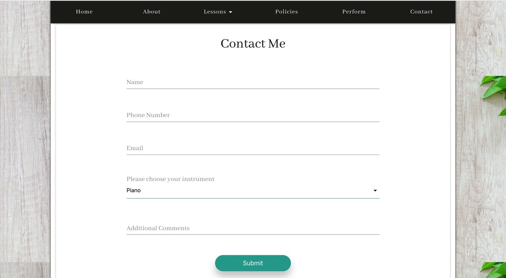

## Alyssa Music Studio 

This project is a web application to advertise music lessons to the public from a private music studio. It includes 6 navigaton links: Home, About, Lessons, Policies, Perform, and Contact. 

## Motivation

My goal is to provide small businesses/individuals with professsional websites and enhanced internet presence. This website is an example of a small business website such as a music studio. 

## Build Status

Build status of continous integration through Travis CI

[](https://travis-ci.com/github/alyssariah/musictemplate)

## Deploy Status

[](https://app.netlify.com/sites/alyssas-musicstudio/deploys)

[Alyssa's Music Studio](https://alyssas-musicstudio.netlify.app/)

## Code Style


## Screenshots





## Tech/Framework Used

__Built with:__
* ReactJS
* Materialize 

## Features

* Navigation bar with drop down menu 
* Navigation bar sticks to the top of the page while scrolling
* Contact form sends email to owner and auto replies to confirm message sent to user
* Responsive layout for mobile, tablet, and desktop sizes


## Code Example

Submit function for contact form

```
handleSubmit (event) {
    event.preventDefault()
    const templateId = 'music_lessons';

    this.sendFeedback(templateId, {name: this.state.name, email: this.state.email, phone: this.state.phone, instrument: this.state.instrument, comments: this.state.comments})
}
sendFeedback (templateId, variables) {
    window.emailjs.send(
        'contact_service', templateId,
        variables
    ).then(res => {
        document.querySelector("form").reset()
        this.setState({formSent: true})
    })
    .catch(err => console.error("Error: ", err))
}
```

## API Reference

[EmailJS](https://www.emailjs.com/docs/) 

## License

&copy; Alyssa Jackson
